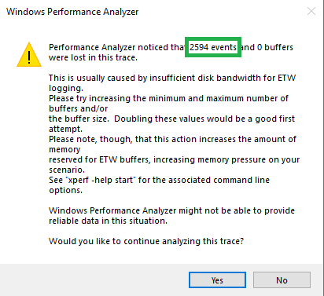
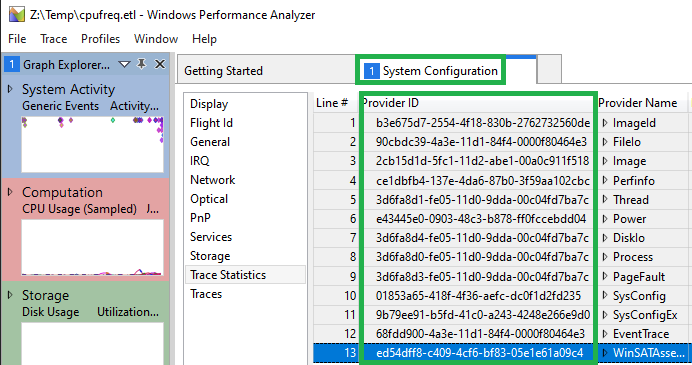

# ETLSmasher

## Compress, remove providers and remove events after a timeframe

- *Note: If the trace file does not compress, either it is already compressed or the trace has missing buffers or events. Check for missing information by opening the trace in WPA.exe.

## Usage

- Compress and remove events with provider ed54dff8-c409-4cf6-bf83-05e1e61a09c4(WinSATAssessment) and remove events after 60 seconds in the trace.

`ETLSmasher.exe --infile:"z:\temp\cpufreq.etl" --outfile:"z:\temp\cpufreq_compressed.etl" --compress:true --removeproviders:ed54dff8-c409-4cf6-bf83-05e1e61a09c4 --removetimeafter:60000`

- Compress and remove events with providers ed54dff8-c409-4cf6-bf83-05e1e61a09c4(WinSATAssessment), 314de49f-ce63-4779-ba2b-d616f6963a88(Microsoft-Windows-NCSI) and 83ed54f0-4d48-4e45-b16e-726ffd1fa4af(Microsoft-Windows-Networking-Correlation)
  
`ETLSmasher.exe --infile:"z:\temp\cpufreq.etl" --outfile:"z:\temp\cpufreq_compressed.etl" --compress:true --removeproviders:ed54dff8-c409-4cf6-bf83-05e1e61a09c4,314de49f-ce63-4779-ba2b-d616f6963a88,83ed54f0-4d48-4e45-b16e-726ffd1fa4af`

- Remove events after 60 seconds in the trace, do not compress.

`ETLSmasher.exe --infile:"z:\temp\cpufreq.etl" --outfile:"z:\temp\cpufreq_compressed.etl" --removetimeafter:60000`

- Only compress a trace.

`ETLSmasher.exe --infile:"z:\temp\cpufreq.etl" --outfile:"z:\temp\cpufreq_compressed.etl" --compress:true`

## To find the ETW event provider guids in a trace use WPA.exe

